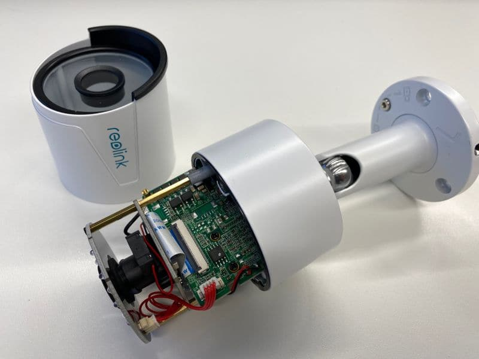
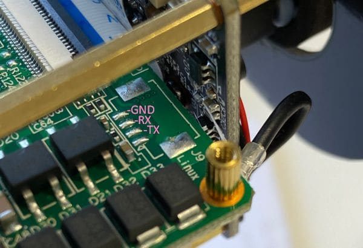

# Reolink RLC-410-5MP IP camera

## Preamble
The Reolink RLC-410-5MP is a 2560x1920 pixel IP camera with infrared night vision, motion detection and PoE support.
The hardware of the camera is quite good (well designed metal casing, multi-layer PCB with high soldering quality).
The software is bad (requiring Flash Player is not acceptable under any circumstances), but not as bad as other cameras I've seen before.
The camera [offers](https://reolink.com/wp-content/uploads/2017/01/Reolink-CGI-command-v1.61.pdf)
[RTMP](https://en.wikipedia.org/wiki/Real-Time_Messaging_Protocol) and [RTSP](https://en.wikipedia.org/wiki/Real_Time_Streaming_Protocol) video
streams. The RTSP stream suffers from various problems ("melting" and "smearing")
when used with non-Reolink video players.



## Hardware

The camera uses a [Novatek NV98515](http://www.novatek.com.tw/en-global/) SoC (MIPS 24KEc V5.5
architecture, dual core with MMU, 640MHz, H.264/265 video encoding, encryption engine)
with a [Omnivision OS05A10M](https://www.ovt.com/sensors/OS05A10) image sensor. The firmware is stored on
a 16 MiB [GD25Q127C](https://www.gigadevice.com/datasheet/gd25q127c/)
[SPI](https://en.wikipedia.org/wiki/Serial_Peripheral_Interface)
[NOR flash](https://en.wikipedia.org/wiki/Flash_memory#NOR_flash).

There probably exist different hardware versions (image sensors) of this
camera (`if ${SENSOR} == "CMOS_SC5035M" .. elif .. "CMOS_OV4689M" .. elif .. "CMOS_OS05A10M"` - The OV4689
ist a 4MP sensor).

### Serial port

There is a `115200 8-N-1` serial port accessible via `J9`:



## Firmware

The firmware is based on Novatek's NA51023 NVT evaluation board SDK (`U-Boot 2014.07`,
`kernel 4.1.0` and a Linux base system based on [Buildroot 2015.11.1-00003-gfd1edb1](https://buildroot.org/)).
See [U-Boot bootloader](log-u-boot.txt) and [Linux misc](log-linux.txt) logfiles for more details.

There is a [µITRON](https://en.wikipedia.org/wiki/ITRON_project)-compatible
[eCos-RTOS](https://en.wikipedia.org/wiki/ECos) running on CPU1 (probably doing the video encoding work),
and Linux running on CPU2 (networking and web frontend application).
The eCos firmware is stored in binary files `FW98515A.bin FW98515T.bin FW98515A.ext.bin`.

Novatek does not release _any_ information about their products. One can find
some brief [datasheet of the NT96650](https://dashcamtalk.com/cams/mobius/Novatek%20NT96650.pdf)
and some [discussion and tools at GoPrawn forum](https://www.goprawn.com/forum/novatek-cams).

### Unpack firmware

Firmware `RLC-410-5MP_448_19061407` is available from Reolink's support website.
With [unpack-novatek-firmware.pl](unpack-novatek-firmware.pl) one can download the firmware file
and extract bootloader, kernel and root filesystem:

```
$ wget -q https://reolink-storage.s3.amazonaws.com/website/firmware/20190614firmware/RLC-410-5MP_448_19061407.zip
$ unzip RLC-410-5MP_448_19061407.zip
Archive:  RLC-410-5MP_448_19061407.zip
  inflating: IPC_51516M5M.448_19061407.RLC-410-5MP.OV05A10.5MP.REOLINK.pak  
$ md5sum RLC-410-5MP_448_19061407.zip IPC_51516M5M.448_19061407.RLC-410-5MP.OV05A10.5MP.REOLINK.pak
e67454a79bcd538fb96d7c8b8a742956  RLC-410-5MP_448_19061407.zip
39c51f59a94a55e0656644a6a0cfea20  IPC_51516M5M.448_19061407.RLC-410-5MP.OV05A10.5MP.REOLINK.pak
$
$ ./unpack-novatek-firmware.pl -w IPC_51516M5M.448_19061407.RLC-410-5MP.OV05A10.5MP.REOLINK.pak
Partition 0    name: loader
Partition 0 version: v1.0.0.1
Partition 0  offset:     1552
Partition 0  length:    32768
Writing output file 'IPC_51516M5M.448_19061407.RLC-410-5MP.OV05A10.5MP.REOLINK-partition-0-loader.bin'

Partition 1    name: ext
Partition 1 version: v1.0.0.1
Partition 1  offset:    34320
Partition 1  length:     2856
Writing output file 'IPC_51516M5M.448_19061407.RLC-410-5MP.OV05A10.5MP.REOLINK-partition-1-ext.bin'

Partition 2    name: uitron
Partition 2 version: v1.0.0.1
Partition 2  offset:    37176
Partition 2  length:  3200936
Writing output file 'IPC_51516M5M.448_19061407.RLC-410-5MP.OV05A10.5MP.REOLINK-partition-2-uitron.bin'

Partition 3    name: uboot
Partition 3 version: v1.0.0.1
Partition 3  offset:  3238112
Partition 3  length:   262664
Writing output file 'IPC_51516M5M.448_19061407.RLC-410-5MP.OV05A10.5MP.REOLINK-partition-3-uboot.bin'

Partition 4    name: 
Partition 4 version: 
Partition 4  offset:  3500776
Partition 4  length:        0

Partition 5    name: kernel
Partition 5 version: v1.0.0.1
Partition 5  offset:  3500776
Partition 5  length:  1634625
Writing output file 'IPC_51516M5M.448_19061407.RLC-410-5MP.OV05A10.5MP.REOLINK-partition-5-kernel.bin'

Partition 6    name: fs
Partition 6 version: v1.0.0.1
Partition 6  offset:  5135401
Partition 6  length:  6242304
Writing output file 'IPC_51516M5M.448_19061407.RLC-410-5MP.OV05A10.5MP.REOLINK-partition-6-fs.bin'

Partition 7    name: 
Partition 7 version: 
Partition 7  offset: 11377705
Partition 7  length:        0

Partition 8    name: 
Partition 8 version: 
Partition 8  offset: 11377705
Partition 8  length:        0

Partition 9    name: 
Partition 9 version: 
Partition 9  offset: 11377705
Partition 9  length:        0

Partition 10    name: 
Partition 10 version: 
Partition 10  offset: 11377705
Partition 10  length:        0

$ unsquashfs -d rootfs/ IPC_51516M5M.448_19061407.RLC-410-5MP.OV05A10.5MP.REOLINK-partition-6-fs.bin
Parallel unsquashfs: Using 4 processors
551 inodes (622 blocks) to write

[===========================================================/] 622/622 100%

created 416 files
created 82 directories
created 135 symlinks
created 0 devices
created 0 fifos

$ ls rootfs/
bin  dev  etc  home  lib  linuxrc  mnt  proc  root  sbin  sys  tmp  usr  var

$ head rootfs/etc/firmware.info 
SDK_VER="NVT_NT96660_Linux_V0.4.8"
BUILDDATE="Tue Mar 1 18:25:28 CST 2016"
```

### Compile additional software

Download [Buildroot 2015.11.1](https://buildroot.org/downloads/buildroot-2015.11.1.tar.gz)
(Novatek's SDK uses this version and newer Buildroot releases use a newer/incompatible uClibc).
Exec `make menuconfig`, select `Target options`, change `Target Architecture`
to `MIPS (little endian)` and `Target Architecture Variant` to `mips 32`.
Select `Target packages` in the main menu and select packages as needed.
Exit and `make`.

### Modify rootfs / add SSH daemon

Use `repack-reolink-rootfs.sh` to repack the (read-only) rootfs on flash partition 6.
Dump squashfs with `cat /dev/mtdblock6 > /mnt/sda/mtdblock6.bin` to SD card
first. Then execute the script on your Linux workstation like this:

```
$ ./repack-reolink-rootfs.sh
551 inodes (622 blocks) to write
created 416 files
created 82 directories
created 135 symlinks
created 0 devices
created 0 fifos
'./contrib/dropbear' -> 'rootfs/usr/sbin/dropbear'
'./contrib/S99dropbear' -> 'rootfs/etc/init.d/S99dropbear'
changed ownership of 'rootfs/usr/sbin/dropbear' from root:root to 1004:1004
changed ownership of 'rootfs/etc/init.d/S99dropbear' from root:root to 1004:1004
Found a valid SQUASHFS 4:0 superblock on mtdblock6-NEW.bin.
Creation or last append time Mon Jan 27 16:42:00 2020
Filesystem size 6201.27 Kbytes (6.06 Mbytes)
Compression xz
Block size 262144
Filesystem is exportable via NFS
Inodes are compressed
Data is compressed
Fragments are compressed
Always-use-fragments option is not specified
Xattrs are compressed
Duplicates are removed
Number of fragments 23
Number of inodes 635
Number of ids 1
-rw-r--r-- 1 8650752 Jan 27 13:01 mtdblock6.bin
-rw-r--r-- 1 6352896 Jan 27 16:36 mtdblock6-NEW.bin
mtdblock6-NEW.bin file size (65536-byte aligned): 0x610000

Execute the following commands within u-boot:

fatload mmc 0 0x1000000 mtdblock6-NEW.bin
sf erase 0x6e0000 0x610000
sf write 0x1000000 0x6e0000 0x610000
reset
```

Then write the modified squashfs to NOR flash of your camera as shown in
script output:

```
NA51023> fatload mmc 0 0x1000000 mtdblock6-NEW.bin
reading mtdblock6-NEW.bin
6352896 bytes read in 0 ms
NA51023> sf erase 0x6e0000 0x610000
SF: 6356992 bytes @ 0x6e0000 Erased: OK
NA51023> sf write 0x1000000 0x6e0000 0x610000
SF: 6356992 bytes @ 0x6e0000 Written: OK
NA51023> reset
```

There's something broken within dropbear's key initial exchange (causing a segfault). You
might need to login using `ssh -oHostKeyAlgorithms=ssh-rsa root@ipaddress`
for the very first time. I don't have time to debug this odd behaviour.

Enjoy logging in to your camera with SSH.

### Firmware versions

- [647_20031401](https://reolink-storage.s3.amazonaws.com/website/firmware/20200314firmware/RLC-410-5MP_647_20031401.zip),
  released 2020/03/14, with GUI v1.0.261

- [448_19061407](https://reolink-storage.s3.amazonaws.com/website/firmware/20190614firmware/RLC-410-5MP_448_19061407.zip),
  released 2019/06/14, with GUI v1.0.242


## Misc

- With `get_sysinfo` debug information about the various video streams
is displayed, see [sample output](log-get_sysinfo.txt).

- The camera uses [nginx](http://nginx.org/) as web server. The RTMP stream is
orchestrated by the [rtmp-module](https://github.com/arut/nginx-rtmp-module).

- One can disable the OSD watermark (without flash interface) with 
[this small script](api-disable-watermark.sh).

- One can find various info about the [NT98515 on Lxnicks's chinese 
  website](https://lxnick.wordpress.com/tag/nt98515/)

